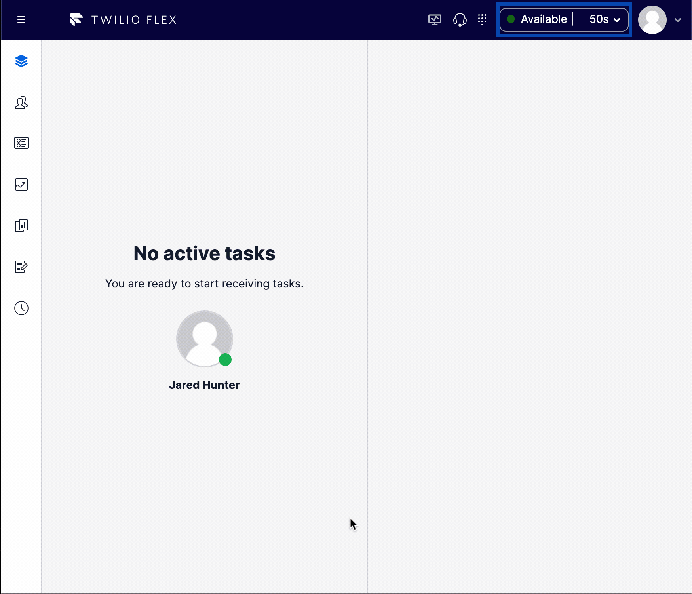

# agent-automation

This feature provides auto select, auto accept and auto wrap up behavior for agent tasks. Tasks qualify for a configuration set based on their channel and a set of required task attributes. The first configuration set to match is the configuration set used.

# known issues

As this is a front end implementation of operations, if the browser is closed will void the automated behavior. For this reason it is advised to also use the `supervisor-complete-reservation` feature in unison with this one to allow supervisors to force complete any reservations that have fallen into this rouge state.

A preferred solution to auto wrapup would require a backend handler to move the state of the task after the given timeout.

# flex-user-experience

An auto selected, auto accepted voice task with an auto wrap up after 5 seconds.



# setup and dependencies

There are no additional dependencies for setup beyond ensuring the flag is enabled within the `flex-config` attributes.

To enable the `Agent Automation` feature, under the `flex-config` attributes set the `agent_automation` `enabled` flag to `true` and set up the desired configuration set for qualifying tasks. Where `channel` is the task router channel name and `required_attributes` are key value pairs of attribute values that need to be present on the task to qualify for the configuration set. The first qualifying configuration set identified is used.

```json
"agent_automation": {
  "enabled": true,
  "configuration": [{
    "channel": "voice",
    "required_attributes": [{"key": "direction", "value": "inbound"}],
    "auto_accept": true,
    "auto_select": true,
    "auto_wrapup": true,
    "wrapup_time": 30000,
    "default_outcome": "Automatically completed"
  }]
},
```

# how does it work?

When enabled, this feature listens for taskReceived events and evaluates whether the tasks matches any configuration sets and if so executes SelectTask & AcceptTask action as configured. This feature also loads a renderless component on the task canvas at wrapup. When the component mounts, if there is a matching task configuration then a timeout is set per the task configuration that triggers a CompleteTask action.

When used in combination with the `dispositions` feature's require disposition setting, that setting will take precedence and prevent auto-wrap-up of the affected task if no disposition is selected. If no disposition is required, the optional `default_outcome` setting allows you to configure the value displayed in Flex Insights for the outcome when the wrapup time expires and there is no disposition selected by the agent via the `dispositions` feature (or it is disabled).